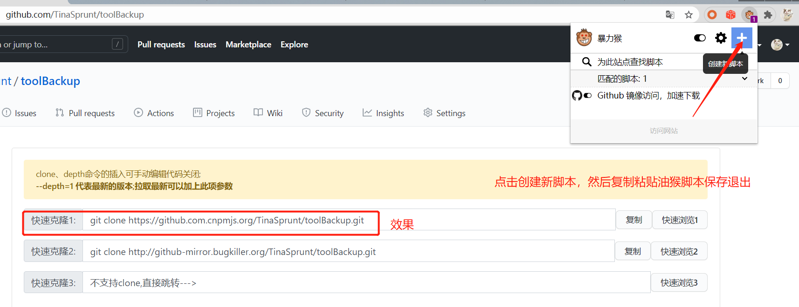

# 个人工具

## github加速
1. 下载油猴脚本
2. 在chromean安装暴力猴(Violentmonkey)插件
3. 在暴力猴插件中加入[油猴脚本](./github_accelerated_oil_monkey.txt)

4. 打开github网页链接选择快速克隆链接


## git 基础命令

#### 常用
```shell
$ git branch -a   #查看当前所有分支
$ git checkout 分支名   #切换到指定
$ git clone 项目地址 -b tag号   #拉取指定tag号的代码（没有与该tag号同名的分支会报warning但是没关系）
$ git clone 项目地址 -b 分支名 新项目名   #拉取指定分支代码到本地并重命名
```


#### 日志查看
```shell
$ git log 
$ git log --pretty=oneline   # 精简log信息
$ git reflog    #全部log信息，包括被回滚的记录
```

#### 版本回退
```shell
$ git reset --hard  xxx版本号    #回滚到指定版本号
```
> 本地的版本回退不会影响到远程，除非进行提交
> 回退后如果不提交到远程，在回滚的基础上进行修改会无法push


#### 缓存区与工作区概念

> 工作区指未add之前
> 缓存区包括 add 以及 commit 


#### 撤销本地修改及提交
```shell

$ git checkout -- xxx文件名 #撤销指定文件的修改

$ git reset -- xxx文件名    #撤销指定文件的add提交，恢复到modify状态

$ git reset --soft xxx版本号  #撤销commit提交，恢复到指定版本号状态(保留最新的本地修改为modify状态，与指定版本号对比的modify)

```
> 只要commit成功就会产生一个版本号，无论是否push


#### 创建和删除分支并推送到远程

```shell

$ git branch -b xxx分支名 #当前分支为基准创建一个新分支

$ git branch -d xxx分支名 #删除指定分支

```
> 执行完成后本地分支立即生效，但是还没有推送到远程
> 此时检查工作树也是空的，因为git status无法检查分支的变更情况
> 分支的创建和删除需要单独add
 
```shell

$ git remote -v #检查当前分支修改是否add,有输出就是已经add了

$ git remote add origin xxx仓库clone地址 # 如果没有add就使用此命令需要添加

$ git push origin xxx新建的分支名  #推送新建分支的变更到远程
$ git push origin :xxx被删除的分支名   #推送删除分支的变更到远程，注意冒号前有空格

$ git remote remove origin   #如果add错了分支变更，可以remove删除分支add

```

#### 合并分支并推送到远程
```shell

$ git checkout A分支名 # 切换到 A 分支 

$ git merge B分支名 # 将 B 分支内容合并到 A 分支

$ git push # 将合并推送到远程

$ git checkout A分支名 # 切换回 A 分支 

```
#### 合并冲突

**方法1.commit提交法**

流程：先把本地修改commit到本地仓（产生一次commit，本地工作区变为clean），再pull远程仓，进行冲突合并,再将合并后的修改commit到本地仓（产生一次commit）,再git push到远程
优点：简单 缺陷：会产生多次commit信息

```shell
# 1.先commit本地修改
git add .
git commit -m "本地修改的代码的说明"

# 2.拉取远程代码
git pull

# 3.git自行本地合并，编辑器提示冲突
在vscode界面点击，选择要保留的代码

# 4.重新本地提交
git add .
git commit -m "合并冲突的代码的说明"

# 5.推送到远程
git push

```

**方法2.stash暂存法( 推荐！！！)**
使用stash暂存修改到本地，再pull远程，再恢复stach暂存的内容，进行冲突合并，再将合并后的修改commit到本地仓（产生一次commit）,再git push到远程

```shell
# 1.暂存本地修改
git stash

# 2.查看stash列表
git stash list

# 3.拉取远程代码
git pull

# 4.恢复本地修改的内容
git stash pop

# 5.git自行本地合并，编辑器提示冲突
在vscode界面点击，选择要保留的代码

# 6.按普通流程提交到远程
git add .
git commit -m "本地修改的代码的说明"
git push

```

ps:执行完 git stash 命令后，modify的文件内容会变成了未修改前，即上一次commit提交的内容


#### 常见问题
[1.为何会产生merge branch dev xxx to dev](http://blog.dreamoon.top/2020/05/31/AvoidMergeMessage/)

[2.为什么不建议git pull --rebase](https://stackoverflow.com/questions/15439527/git-why-merge-branch-master-of-when-pull-and-push)

[3.如何使用git stash解决冲突](https://blog.csdn.net/cnds123321/article/details/110743787)

[4.多次git stash怎么用](https://blog.csdn.net/daguanjia11/article/details/73810577)
