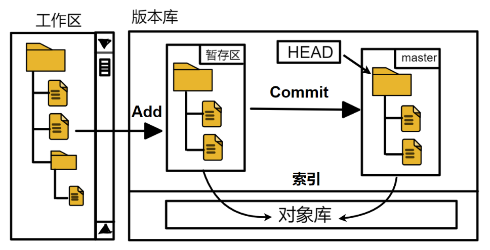

# git 基础命令

## 常用

```shell
$ git branch -a   #查看当前所有分支
$ git checkout 分支名   #切换到指定
$ git clone 项目地址 -b tag号   #拉取指定tag号的代码（没有与该tag号同名的分支会报warning但是没关系）
$ git clone 项目地址 -b 分支名 新项目名   #拉取指定分支代码到本地并重命名
```

## 日志查看

```shell
$ git log
$ git log --pretty=oneline   # 精简log信息
$ git reflog    #全部log信息，包括被回滚的记录
```

## 版本回退

```shell
$ git reset --hard  xxx版本号    #回滚到指定版本号
```

> 本地的版本回退不会影响到远程，除非进行提交
> 回退后如果不提交到远程，在回滚的基础上进行修改会无法 push

```shell
git push -f <remote> <branch name> # 强制推送到远程指定分支
```
> 此时版本回退已经提交到远程，本地和远程的最新版本都是 xxx版本号

## 缓存区与工作区概念



> 工作区指未 add 之前
> 缓存区包括 add 以及 commit

## 撤销本地修改及提交

```shell

$ git checkout -- xxx文件名 #撤销指定文件的修改，慎重！撤销掉的修改将无法找回

$ git reset -- xxx文件名    #撤销指定文件的 add 提交，恢复到 modify 状态

$ git reset --soft <commitHash>  #撤销 commit 提交，恢复到指定版本号状态(保留最新的本地修改为 modify 状态，与指定版本号对比的modify)

$ git merge --abort #撤销本地合并（对没有 push 的 merge 使用）

```

> 只要 commit 成功就会产生一个版本号，无论是否 push

## 创建和删除分支并推送到远程

```shell

$ git branch xxx分支名 #当前分支为基准创建一个新分支

$ git branch -d xxx分支名 #删除指定分支

```

> 执行完成后本地分支立即生效，但是还没有推送到远程
> 此时检查工作树也是空的，因为 git status 无法检查分支的变更情况
> 分支的创建和删除需要单独 add

```shell

$ git remote -v #检查当前分支修改是否add,有输出就是已经add了

$ git remote add origin xxx仓库clone地址 # 如果没有add就使用此命令需要添加

$ git push origin xxx新建的分支名  #推送新建分支的变更到远程
$ git push origin :xxx被删除的分支名   #推送删除分支的变更到远程，注意冒号前有空格

$ git remote remove origin   #如果add错了分支变更，可以remove删除分支add

```

## 合并分支并推送到远程

```shell

$ git checkout A分支名 # 切换到 A 分支

$ git merge B分支名 # 将 B 分支内容合并到 A 分支

$ git push # 将合并推送到远程

$ git checkout A分支名 # 切换回 A 分支

```

## 合并冲突

使用 stash 暂存修改到本地，再 pull 远程，再恢复 stach 暂存的内容，进行冲突合并，再将合并后的修改 commit 到本地仓（产生一次 commit）,再 git push 到远程

```shell
# 1.暂存本地修改
git stash

# 2.查看stash列表
git stash list

# 3.拉取远程代码
git pull

# 4.恢复本地修改的内容
git stash pop

# 5.git自行本地合并，编辑器提示冲突
在vscode界面点击，选择要保留的代码

# 6.按普通流程提交到远程
git add .
git commit -m "本地修改的代码的说明"
git push

```

ps:执行完 git stash 命令后，modify 的文件内容会变成了未修改前，即上一次 commit 提交的内容

## 忽略部分文件不进行合并

1. 在待合并的项目根目录下创建 .gitattributes（保证A分支，B分支下都有这个文件）

2. 创建针对当前仓库的，名为 ours 的自定义 merge driver


```shell
# 在待合并项目的 git bash 中执行此命令
git config --loacl merge.ours.driver true
```

 3. 在 .gitattributes 文件中写入合并时需要忽略的文件，(如下，表示不合并 gitlab-ci.yml )

 ```shell
 gitlab-ci.yml merge=ours
 ```

4. 推送 .gitattributes 文件到远程（保证A分支，B分支下都有这个文件）

5. 按照正常的合并流程进行merge即可，此时 merge 将不会检查 .gitattributes 中忽略的文件


## 合并部分commit提交

参考：https://www.ruanyifeng.com/blog/2020/04/git-cherry-pick.html

```shell
$ git checkout A分支名 # 切换到 A 分支

# 合并单个提交
$ git cherry-pick  <commitHash> --continue # 将其他分支的某次提交(commitHash表示 commitid)合并到分支A 

# 合并多个提交
$ git cherry-pick <commitHashA> <commitHashB> --continue # 将其他分支的多个提交合并到分支A （--continue表示如果发生代码冲突，Cherry pick 会停下来，让用户决定如何继续操作）

# 将合并结果推送到远程
$ git push # 将合并结果推送到远程

# 如何取消合并
$ git cherry-pick --abort # 退出 Cherry pick，并撤销所有修改

# 如何退出合并状态
$ git cherry-pick --quit # 发生代码冲突后，退出 Cherry pick，但是不回到操作前的样子

```

> 使用 git cherry-pick 本质上并不是合并，如 `git cherry-pick <commitHashA> <commitHashB> `
>
> 只是将其他分支的` <commitHashA> <commitHashB> `两次提交复制到分支A中
>
> 分支A上会产生新的2条 commit 记录，`commitHashC` 和 `commitHashD`，其中 `commitHashC` 内容与 `commitHashA` 完全一致，其中 `commitHashD` 内容与 `commitHashB` 完全一致，效果上可以当作合并使用
>

#### 常见问题

[1.为何会产生 merge branch dev xxx to dev](http://blog.dreamoon.top/2020/05/31/AvoidMergeMessage/)

[2.为什么不建议 git pull --rebase](https://stackoverflow.com/questions/15439527/git-why-merge-branch-master-of-when-pull-and-push)

[3.如何使用 git stash 解决冲突](https://blog.csdn.net/cnds123321/article/details/110743787)

[4.多次 git stash 怎么用](https://blog.csdn.net/daguanjia11/article/details/73810577)

[5.git pull = git fetch + git merge的理解](https://github.com/febobo/web-interview/issues/224)
